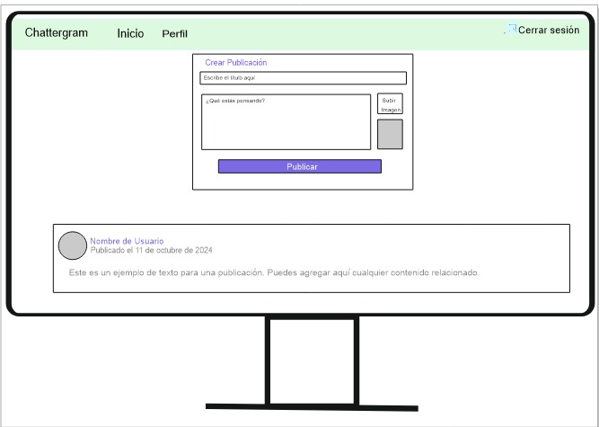
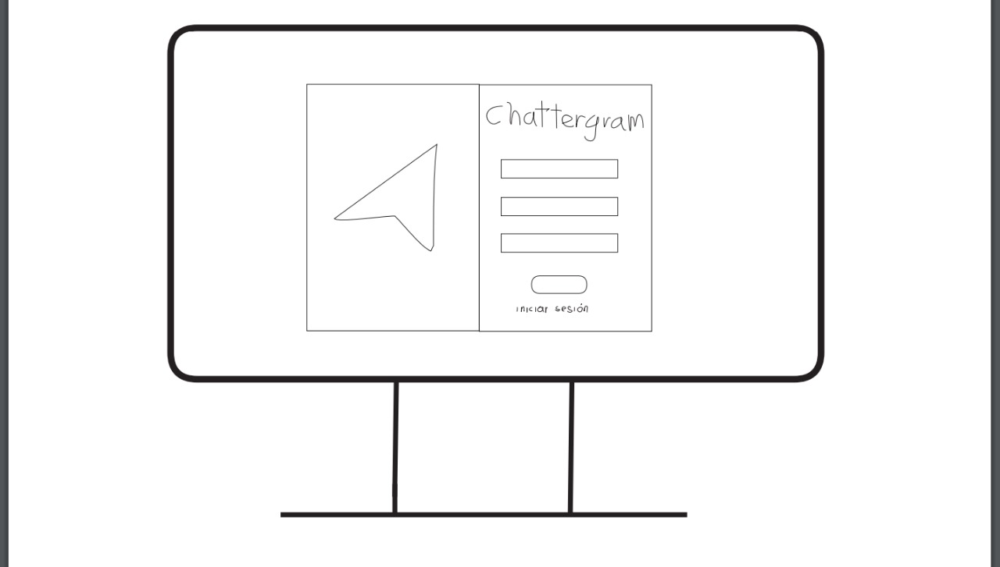
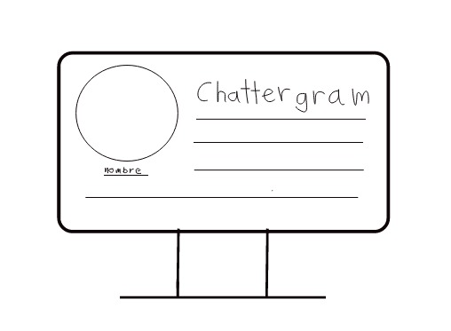
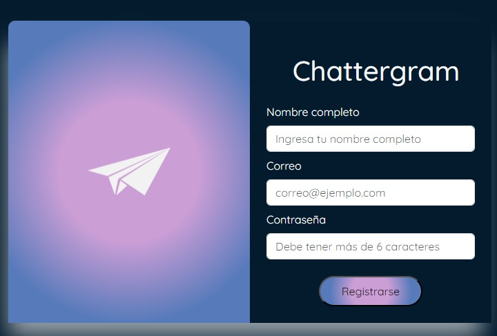

# 
 💯💯 CHATTERGRAM 💯💯 

Chattergram es una innovadora red social que permite a los usuarios conectarse, comunicarse y compartir experiencias de manera única. Diseñada para facilitar interacciones significativas, Chattergram combina una interfaz intuitiva con potentes funcionalidades para crear un entorno social atractivo y dinámico.

## Características 📜📜
Interfaz Amigable: Navegación sencilla y atractiva que mejora la experiencia del usuario.
Registro y Autenticación: Los usuarios pueden crear cuentas y gestionar su información de manera segura.
Publicaciones y Mensajes: Comparte contenido y comunica con amigos de forma rápida y efectiva.
Conexiones: Encuentra y sigue a amigos y familiares para mantenerte en contacto.
- **Interfaz Amigable:** Navegación sencilla y atractiva que mejora la experiencia del usuario.
- **Registro y Autenticación:** Los usuarios pueden crear cuentas y gestionar su información de manera segura.
- **Publicaciones y Mensajes:** Comparte contenido y comunica con amigos de forma rápida y efectiva.
- **Conexiones:** Encuentra y sigue a amigos y familiares para mantenerte en contacto.

## Resumen 📖📖
Las redes sociales son estructuras formadas en Internet por personas u organizaciones que se conectan a partir de intereses o valores comunes. A través de ellas, se crean relaciones entre individuos o empresas de forma rápida, sin jerarquía o límites físicos.
Por ello mi equipo y yo creamos Esta pagina de red social diseñada para conectar a personas con intereses similares y facilitar la comunicación y el intercambio de contenido.

## 📌Objetivos del proyecto🌟🌟

El principal propósito de las redes sociales es el de conectar personas. Completas tu perfil en canales de social media e interactúas con las personas con base en los detalles que leen sobre ti. Se puede decir que las redes sociales son una categoría de social media.
La principal función de una red social es conectar personas dentro del mundo virtual, sea para construir nuevas conexiones sociales o solo para mantener las existentes. 

## Proceso de Diseño 🎨🎭🎭

1. **Investigación y Planificación 🏋️‍♀️🏋️‍♀️:**

1.1. Conoce a tu público : Estudiar a tu público puede ayudarte a decidir qué tipo de publicaciones funcionarán mejor. También puede ayudarte a elegir las plataformas de redes sociales más adecuadas para tus publicaciones.
 
 <lo>Ejemplos : </lo>
<li>Edad</li>
<li>Género</li>
<li>Educación</li>
<li>Ingresos</li>
<li>Intereses</li>

2.1 Establece objetivos 🎯🎯: necesitan objetivos para poder medir el rendimiento. Estos son algunos objetivos que puedes fijarte para tu estrategia en redes sociales

<ol> Ejemplos :</ol>
<li>Conocimiento de la marca</li>
<li> Tráfico hacia el sitio web</li>
<li>Interacción</li>

3.1 Evalúa el contenido 🖨️🖨️: Una vez que hayas publicado tu contenido, no te olvides de él. Reevalúa tu contenido habitualmente para analizar qué tipos de publicaciones funcionan bien y generan una mayor interacción con tu público objetivo.

2. **Desarrollo del Prototipo💻💻:**

 Para el desarrolo del prototipo decidimos seguir un poco el diseño de la red social instagran lo tomamos como ejemplo por que nos parecio que tenia una buena estructura de datos y nos parecio mas versatil para poder realisar nuestra propia pagina de red social.
 El prototipo sirven como visiones inicial de la práctica del producto a realizar. Este prototipo simples solo comparten algunas características con el producto final. Es ideal para probar conceptos amplios y validar ideas.

3. **Implementación 🔎🔎:**

 Implementamos el diseño en HTML, CSS , JavaScript , Bootstrap y Firebase para poder realisar un buen trabajo con esas 
 Pruebas y Ajustes: Realización de pruebas para asegurar la funcionalidad y la usabilidad de la aplicación. Se hicieron ajustes basados en el feedback y las pruebas para mejorar la experiencia del usuario.
  
## Solución del Problema del Usuario 📢🛠️

- **Centralización de Información:** Proporciona seguridad al navegar en este sitio web ya que cuenta con una contraseña por cada usuari unido priorisa la seguridad de cada uno de los usuarios en navegacion en el sitio web Chattergram.
  
- **Datos Actualizados:**Chattergram ofrece información precisa y actualizada sobre las publicaciones realizadas en la pagina.

- **Interfaz Intuitiva:** Facilita una navegación clara y atractiva, mejorando la experiencia del usuario al explorar nuestro sitio web con una variedad de experiencias compartidas por diferentes usuarios.

Con esta aplicación, los usuarios pueden acceder fácilmente a comentarios sobre anecdotas u hechos que acontecieron en su vida y abra una bariedad de publicaciones con las cuales el usuari podria compartir ya sea con personas que no conose lo cual genera una experiencia social y poder crear lazos de amistad entre unos y otros.

## Historia de Chattergram 🎬🎬

Para la creacion de Chattergram primero decidimos guiarnos del modelo de Instagram ya que nos parecio que tenia una buena estructura, pero luego le dimos nuestro propio diseño ya sea la planificacion y el color de nuestra pagina. Chattergram fue creada con la finalidad de que las personas puedan iteractuar entre si ya sea compartiendo situasiones entre si u crusandose en algunos gustos que son similares a ellos y engeneral que las personas socialicen y puedan crear nuevos lasos de amistad.

## Prototipos

### Prototipo de Baja Fidelidad 📝

 Página Principal
 

Pagina de Inicio de Seción

Página de Perfil

 
### Prototipo de Alta Fidelidad 💻

Pagina de Inicio de Seción

## Tecnologías Utilizadas 👓👓

A continuación, se muestran las tecnologías utilizadas en el desarrollo de Chattergram:

## 👩‍💻👩‍💻Creado por: 

* [Mishell Arroyo](https://github.com/Mishell-A)
* [Oriana](https://github.com/ori27-ops)
* [Brizett-TB](https://github.com/Brizett-TB)
* [GuadalupeCampos](https://github.com/GuadalupeCampos)
* [guadalupe56-dot](https://github.com/guadalupe56-dot)